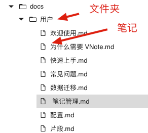
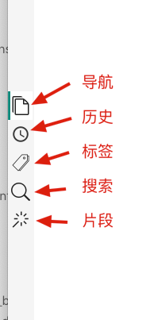
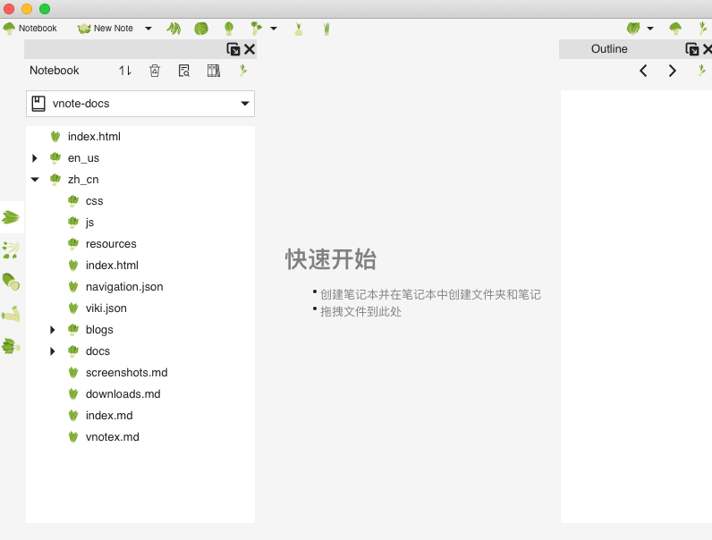

# 主题和样式
## 主题
**主题**用于指定VNote的外观、编辑器和阅读模式的样式，以及代码块的语法高亮样式。

一个主题对应于`themes`文件夹中的一个子文件夹。可以通过`设置`对话框中更改或者管理主题。


### 如何添加一个主题
一个好的做法是基于一个已有的主题来进行自定义一个新的主题。复制您最喜欢的主题的文件夹到**用户配置**文件夹下面的`themes`文件夹下面。记得重命名该文件夹。

### 主题的成分
一个主题的一些关键文件：

- `palette.json`: 主题的调色文件，定义了主题中会用到的各种颜色；
- `interface.qss`: 这是一个[**Qt样式文件**](http://doc.qt.io/qt-5/stylesheet-reference.html)，定义了所有窗口部件的外观；该文件会使用`palette.json`里面定义的颜色；
- `text-editor.theme`: 文本编辑器（以及Markdown编辑器）的主题文件；
- `web.css`: Markdown阅读模式的样式文件；
- `highlight.css`: Markdown阅读模式的代码块语法高亮样式文件；VNote在阅读模式使用[Prism](https://prismjs.com/)来进行语法高亮;
- `icons`: 自定义图标文件夹 **可选** ；

## 示例
### 自定义编辑器字体
#### 阅读模式
**阅读模式**的字体定义在文件`web.css`的`font-family`和`font-size`中。

正文的样式：

```css
body {
    margin: 0 auto;
    font-family: -apple-system, "Noto Sans", "Helvetica Neue", "Segoe UI", Helvetica, sans-serif, Tahoma, Arial, Geneva, Georgia, Palatino, "Times New Roman", "冬青黑体", "YaHei Consolas Hybrid", "Microsoft YaHei", "微软雅黑", "Microsoft YaHei UI", "WenQuanYi Micro Hei", "文泉驿雅黑", Dengxian, "等线体", STXihei, "华文细黑", "Liberation Sans", "Droid Sans", NSimSun, "新宋体", SimSun, "宋体", "Apple Color Emoji", "Segoe UI Emoji";
    color: #222222;
    line-height: 1.5;
    padding: 16px;
    background-color: #f5f5f5;
    font-size: 16px;
}
```

代码块和行内代码的样式：

```css
code {
    font-family: "YaHei Consolas Hybrid", Consolas, Monaco, Monospace, Courier;
    color: #8e24aa;
    word-break: break-word;
}

pre code {
    display: block;
    padding-left: 0.5em;
    padding-right: 0.5em;
    color: #222222;
    background-color: #e0e0e0;
    line-height: 1.5;
    font-family: "YaHei Consolas Hybrid", Consolas, Monaco, Monospace, Courier;
    white-space: pre;
    -moz-tab-size: 4;
    -o-tab-size: 4;
    tab-size: 4;
}
```

对于有语法高亮的代码块，其样式定义在文件`highlight.css`中：

```css
code[class*="language-"],
pre[class*="language-"] {
    color: black;
    background: none;
    font-family: Consolas, Monaco, 'Andale Mono', 'Ubuntu Mono', monospace;
    font-size: 1em;
    text-align: left;
    white-space: pre;
    word-spacing: normal;
    word-break: normal;
    word-wrap: normal;
    line-height: 1.5;

    -moz-tab-size: 4;
    -o-tab-size: 4;
    tab-size: 4;

    -webkit-hyphens: none;
    -moz-hyphens: none;
    -ms-hyphens: none;
    hyphens: none;
}
```

#### 文本编辑器和Markdown编辑器
文本编辑器和Markdown编辑器的字体定义在`text-editor.theme`文件。

文本编辑器：

```json
{
    "editor-styles" : {
        "Text" : {
            "//comment" : "Support a list of fonts separated by ,",
            "font-family" : "YaHei Consolas Hybrid, Consolas, Monaco, Andale Mono, Monospace, Courier New",
            "font-size" : 12,
            "text-color" : "#222222",
            "background-color" : "#f5f5f5",
            "selected-text-color" : "#f5f5f5",
            "selected-background-color" : "#1976d2"
        }
    }
}
```

Markdown编辑器：

```json
{
    "markdown-editor-styles" : {
        "Text" : {
            "//comment" : "Support a list of fonts separated by ,",
            "font-family" : "冬青黑体, YaHei Consolas Hybrid, Microsoft YaHei, 微软雅黑, Microsoft YaHei UI, WenQuanYi Micro Hei, 文泉驿雅黑, Dengxian, 等线体, STXihei, 华文细黑, Liberation Sans, Droid Sans, NSimSun, 新宋体, SimSun, 宋体, Verdana, Helvetica, sans-serif, Tahoma, Arial, Geneva, Georgia, Times New Roman",
            "font-size" : 12,
            "text-color" : "#222222",
            "background-color" : "#f5f5f5",
            "selected-text-color" : "#f5f5f5",
            "selected-background-color" : "#1976d2"
        }
    }
}
```

### 自定义界面字体
我们需要编辑`interface.qss`来自定义界面字体，例如菜单或者导航树。

[Qt文档](https://doc.qt.io/qt-5/stylesheet-examples.html)提供了关于Qt样式的很详细的例子。

改变所有部件的字体大小：

```css
QWidget {
    font-size: 12pt;
}
```

改变所有树或者列表部件的字体大小：

```css
QTreeView, QListView {
    font-size: 12pt;
}
```

改变笔记本节点浏览器的字体大小：

```css
vnotex--NotebookNodeExplorer QTreeView {
    font-size: 14pt;
}
```

### 自定义图标

Vnotex 支持在主题中添加自定义图标文件夹 `icons`，往里面放置对应名称的 `svg` 格式图片后，即可实现主题中的图标定制化。

目录样例结构如下：

```
.
├── cover.png
├── highlight.css
├── icons
│   ├── ***.svg
│   ├── ***.svg
│   └── ***.svg
├── interface.qss
├── palette.json
├── text-editor.theme
└── web.css
```

常用图标的名称对应关系：

**笔记**



| 名称             | 解释   |
| :-------------- | :----- |
| folder_node.svg | 文件夹 |
| file_node.svg   | 笔记   |

**顶部菜单**

从左到右


| 名称                   | 解释       |
| :-------------------- | :-------- |
| notebook_menu.svg     | 笔记本     |
| new_note.svg          | 新建笔记   |
| import_menu.svg       | 导入       |
| export_menu.svg       | 导出       |
| flash_page_menu.svg   | 灵犀页     |
| quick_access_menu.svg | 快速访问   |
| task_menu.svg         | 任务       |
| united_entry.svg      | 统一入口   |
| expand.svg            | 扩展内容区 |
| settings_menu.svg     | 设置       |
| menu.svg              | 菜单       |

**左侧导航栏**

从上到下



| 名称                 | 解释 |
| :------------------ | :--- |
| navigation_dock.svg | 导航 |
| history_dock.svg    | 历史 |
| tag_dock.svg        | 标签 |
| search_dock.svg     | 搜索 |
| snippet_dock.svg    | 片段 |


效果如下



